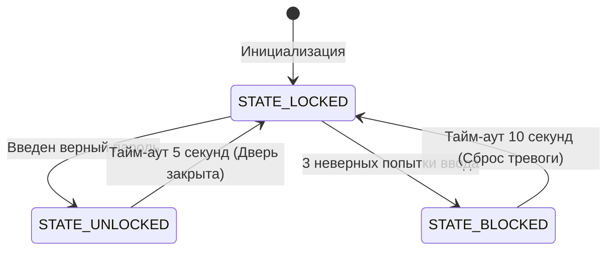

# Enterprise IoT Security System (C++ / Python / PostgreSQL)

Прототип объектно-ориентированной системы контроля и управления доступом (СКУД) на базе микроконтроллера **Arduino Uno (ATmega328P)** с интеграцией с бэкендом на **Python 3** и реляционной базой данных **PostgreSQL**.

Проект демонстрирует построение отказоустойчивой IoT-архитектуры: от низкоуровневого управления периферией и реализации конечных автоматов на Си/C++ до асинхронного сбора логов и enterprise-логирования в промышленную СУБД.

## 🛠 Технологический стек
* **Firmware (Железо):** C++ (ООП, FSM), PlatformIO фреймворк Arduino.
* **Backend:** Python 3, PySerial (двусторонний асинхронный обмен данными по UART).
* **Database:** PostgreSQL (реляционная СУБД, безопасная параметризованная вставка данных).

---

## 📐 Архитектура системы

Система построена на паттерне **Конечного Автомата (Finite State Machine - FSM)**, что исключает блокирующие задержки (`delay()`) и обеспечивает мгновенный отклик на команды:



1. **Микроконтроллер (Arduino Uno)** инкапсулирует логику безопасности в классе `SecuritySystem`. Он считывает входящий поток байт по UART, управляет состояниями и физическим исполнителем (встроенный светодиод Pin 13 / Силовое реле замка).
2. **Управляющий скрипт (Python)** работает в многопоточном режиме (`threading`): один поток асинхронно слушает ответы от железа, второй — принимает команды пользователя из консоли.
3. **База данных (PostgreSQL)** сохраняет все события в реальном времени с автоматической классификацией типов инцидентов (`ACCESS_GRANTED`, `ACCESS_DENIED`, `ALARM_ACTIVATED`).

---

## ⚡ Инсталляция и запуск

### 1. Подготовка базы данных
Создайте базу данных в PostgreSQL (например, `iot_security`) и выполните скрипт. Скрипт автоматически инициализирует таблицу `security_logs` со следующей структурой:
* `id` (SERIAL PRIMARY KEY)
* `timestamp` (TIMESTAMP)
* `event_type` (VARCHAR)
* `raw_message` (TEXT)

### 2. Сборка и прошивка микроконтроллера
Убедитесь, что у вас установлено расширение **PlatformIO** в VS Code.
1. Подключите Arduino Uno SMD R3 к ПК по USB.
2. Проверьте ваш COM-порт в системе и при необходимости укажите его в `platformio.ini`.
3. Запустите команду сборки и загрузки:
```bash
pio run --target upload
```

### 3. Запуск управляющего софта на Python
1. Установите зависимости:
```bash
pip install pyserial psycopg2-binary
```
2. Откройте `scripts/app.py` и укажите ваши параметры подключения в `DB_CONFIG` (host, port, user, password).
3. Перейдите в терминал и запустите клиент:
```bash
python scripts/app.py
```

---

## 📊 Демонстрация работы логов (Data Output)

Данные сохраняются в СУБД в кодировке **UTF-8**. Пример выборки событий безопасности через SQL-запрос `SELECT * FROM security_logs;`:

| id | timestamp | event_type | raw_message |
| :--- | :--- | :--- | :--- |
| 1 | 2026-07-20 19:40:16 | SYSTEM_START | === СИСТЕМА ОХРАНЫ ЗАПУЩЕНА === |
| 2 | 2026-07-20 19:41:05 | ACCESS_GRANTED | [ДОСТУП РАЗРЕШЕН] Светодиод 13 зажжен на 5 секунд. |
| 3 | 2026-07-20 19:42:10 | ACCESS_DENIED | [ОШИБКА] Неверный пароль. Осталось попыток: 2 |
| 4 | 2026-07-20 19:42:30 | ALARM_ACTIVATED | [ТРЕВОГА!] Превышено число попыток. Блокировка на 10 секунд. |

## 🚀 Перспективы развития проекта
* Замена Arduino Uno на **ESP32** для беспроводного подключения по Wi-Fi (MQTT / WebSockets).
* Развертывание Web-интерфейса управления на базе **FastAPI** / **Flask** для мониторинга логов в браузере.
